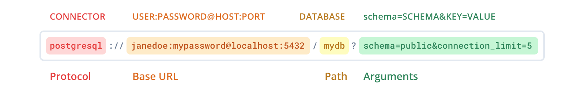

# Prisma

## schema.prisma

- syntax (relational database)

1. `@id` is for primary key
2. `@default` set default value
3. `@unique` no repeat
4. `enum`
5.

```prisma

```

- 

## Link

[Learning Prisma](https://www.prisma.io/blog/fullstack-nextjs-graphql-prisma-oklidw1rhw#what-the-course-will-cover)
